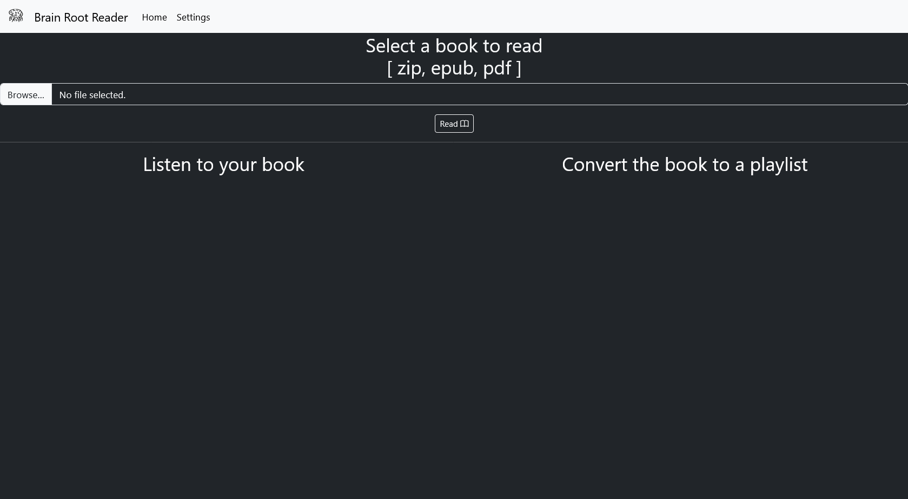
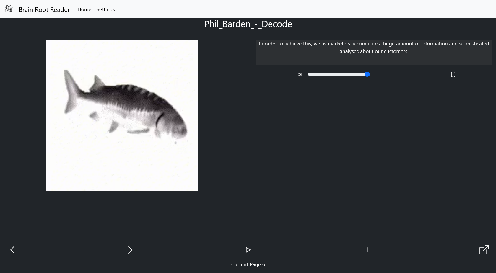
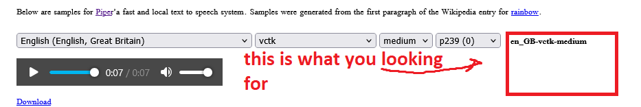

# How to start using BRR (Brain Root Reader)?
```

# clone the project: 
git clone https://github.com/floorwarior/brainrootreader-stable

# move into the folder
cd brainrootreader

# make a virtual environment so your packages do not leak
python.exe -m venv .venv

# or on linux:
python3 -m venv .venv

# activate the virtual environment
.venv\Scripts\activate.bat

# or on linux:
source .venv/bin/activate

# install dependencies:
pip install -r requirements.txt

# run the background.py file on windows:
python.exe background.py #if you want a more portable build (exe), you want to look at the [releases](https://github.com/floorwarior/brainrootreader-stable/releases)

# run the backgroun.py file on linux:
python3 -m background.py

```
# Dependencies:
## piper-tts depends on [espeak-ng](https://github.com/espeak-ng/espeak-ng):
- to run BRR you will have to install the latest release of espeak-ng
- without this the app/project will not run
- [espeak-ng releases](https://github.com/espeak-ng/espeak-ng/releases)
- look for assets, download and install espeak-ng.msi on windows
## zip conversion depends on [pytesseract](https://pypi.org/project/pytesseract/) which requires [tesseract](https://github.com/UB-Mannheim/tesseract/wiki) to be installed.
- **NOTE: this is not needed for any other type of conversion**


# Once BRR is running:
- visit http://localhost:5003


- upload the book you want to listen to and start listening or converting


# What can i convert with BRR?
| Filetype              | Can it convert | Limitations |
| :---------------- | :------: | ----: |
| Epub ( should pretty much always work )        |   Yes [X]   | No image/diagram/table conversion |
| Pdf ( true pdf not image )        |   Yes [X]   | same as epub |
| Pdf ( made from images )           |   Yes [X]   | you first have to convert the pages into images then convert this to a zip file |
| Zip ( from images of old books )    |  Can, but not reliable [X]   | Bad Image quality, Bad lighting, Shadows, Wrinkles |
| Txt (simple .txt files ) | Yes [X] | Should be okay to use for videos as long as you check if the voice can be used in such fashion |

## Tips for zip:
    - you want to first take a picture of every page of a book.
    - test the images on http://localhost:5003/testimage to make sure they are good quality
    - take the pictures in good lighting
    - after this you will have to zip this whole folder, NOTE that your zip's name is going to be used as the name of the book after conversion.

# How to add new voice models?
## There are a few different ways to do it:
- to sample the voices you can checkout this [link](https://rhasspy.github.io/piper-samples/) you can either download one from there and place the files inside the readers models folder in this case: [pipermodels](./pipermodels/)

- alternativly you can try the built in downloader [VoiceBag](http://localhost:5003/voicebag) if you combaine these 2, you can sample the voice and then look for its name on the right:




- download from the [VoiceBag](http://localhost:5003/voicebag)

:


- if you are more confident in your skills you can look dirrectly [here](https://huggingface.co/rhasspy/piper-voices/tree/main)

after you got your model you need to select it in the [settings](http://localhost:5003/settings), for your reader

# How to change fallback order of readers ?
in the [globalvoicemodelsettings](./readerconfigs/globalreader.json)
```
{
    "name": "PiperReader",
    "type": "builtin",
    "comment": "To use this you can pick either *builtin* or if you want to use a selfmade reader you need to use *custom*",
    "comment2": "The name also have to match the name of the class you want to import",
    "comment3": "Add the ClassName and its config filename to readerconfigs.json",
    "fallbackorder": [
        "PiperReader",
        "SherpaReader",
        "WinReader",
        "AndroidReader",
        "BrowserReader"
    ],
    "comment4": "We set the correct order for the readers, the default selected reader is PiperReader, and in the worst case we use the Browser Reader which should always be available"
}
```

# How to add my own reader?
your reader should subclass [BaseReader_in_bookreaders.py](./helpers/bookreaders.py)
Most importantly you will have to implement *Speak* and *save_audio*
If your reader imported okay and it's ready to use you need to set both imported_ok and ready to true
Base Reader:
```

class BaseReader(ABC):

    def __init__(self,*args,speaker="there was no speaker specified",**kwargs):
        self.speaker = speaker
        self.imported_ok = False
        self.ready = True
        self.base_path = kwargs.get("base_path")
        self.origin = "builtin"
        self._on_speak_panic = lambda *args,**kwargs: print("speak has failed, default panic triggered because of:",kwargs.get("error"))
        self._on_audio_save_panic = lambda *args,**kwargs: print("audio save failed, default panic triggered because of error:",kwargs.get("error"))
        self.output_ending = "wav"
       
    
    def is_ready(self):
        return self.imported_ok and self.ready

    @abstractmethod
    def save_audio(self,*args,**kwargs):
        """overwrite this to save the audio based on how the reader works"""
        text = kwargs.get("text")
        audio_out_name = kwargs.get("filename")

    @abstractmethod
    def Speak(self,*args,**kwargs):
        """
        """
        text = kwargs.get("text")


    def get_voices(self,*args,**kwargs):
        """should return a maping to the voices, if you do not define it yourself it will always returns an empty dict"""
        return {}


    def on_audio_panic(self,*args,**kwargs):
        self._on_audio_save_panic(*args,**kwargs)


    def on_speak_panic(self,*args,**kwargs):
        self._on_speak_panic(*args,**kwargs)
```
check out [piper_reader](./helpers/bookreaders.py) to get a better idea
to add your own reader you need to first put its implementation in [plusreaders_folder](./plusreaders)
then you also have to add it by name to [the_plusreaders_by_name_config](./plusreaders/plusreadersbyname.json):
```
{
    "examplereader":"MyReader",
    "testreader":"ThisIsTest"
}
# follow the pymodul:Classname convention
```
after this you need to define a config file that your reader needs in [readerconfigs](./readerconfigs/readerconfigs.json), put the config into [readerconfigs](./readerconfigs/)
```
{
    "PiperReader":"piperconfig.json",
    "WinReader":"winconfig.json",
    "MyReader":"myreader.json",
    "ThisIsTest":"thisistest.json",a
    "GoogleReader":"googlereader.json",
    "AndroidReader":"androidreader.json",
    "BrowserReader":"browserreader.json",
    "SherpaReader":"sherpareader.json"
}
# if you reader does not need a config file you still need to add one here, but you can leave it with: {}
```
with all of these step your reader will be picked up by BRR, and should show up in http://localhost:5003/settings