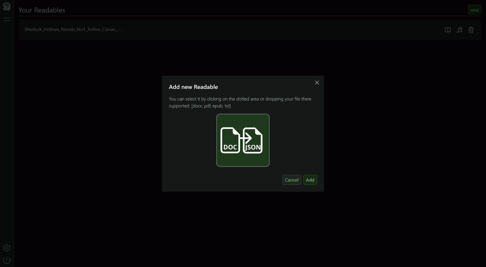
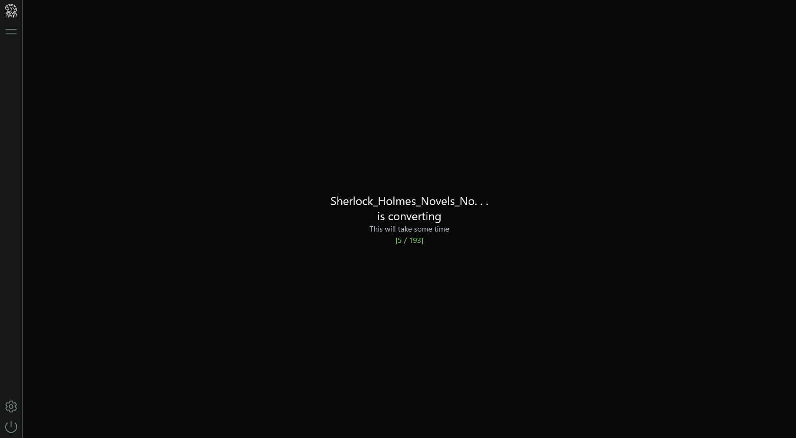
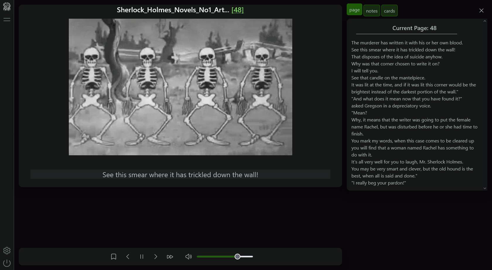

# What is BrainRootReader (BRR)?
It's a Read Aloud app that can read epub, docx, pdf and txt files.
It can also convert to a one file audiofile that you can take with you.

# In Action:


[](https://www.youtube.com/watch?v=WOMDvKrFd4Y)

# Quickstart
```
# clone repo
git clone https://github.com/floorwarior/brainrootreader-stable

# navigate into folder
cd brainrootreader-stable

# make a venv
python.exe -m venv .venv

# activate it 
.venv\Scripts\activate


# install base requirements
pip install -r requirements-[base].txt


# pick a backend to use.
pip install -r requirements-[piper-tts].txt

# select it in the ./appconfig.toml file
# [reader]
# selected_reader = "<YourReader>" example: PiperReader

# run the app:
python.exe background.py
```

# Binary Dependencies: How To:
some packages depend on other binaries to run
to install them you can follow these simple steps:
1. go to dependecies site.
2. locate download button
3. download
4. install
5. open up windows search bar: type "edit the system environment variables" -> enter
6. click Enviroment Variables
7. from the list double click Path
8. click new 
9. locate the dependecy that you installed, copy the path of it's folder 
10. paste, save and exit 
11. verify that it is correct by opening a command promt and typing it's name with the help flag, example: espeak-ng --help


# Once BRR is running visit http://localhost:5003

- load your doc:


- when converting:


- upload the book you want to listen to and start listening or converting into an audio file


# Controls on Read book page:
| Button | Controls: |
| :----- | ----: | 
| s / space | generate audio, start/pause reading  |
| n | next page |
| p | previous page |
| b | bookmark page |
| j then b | jump to bookmarked page |
| j | open jump to dialog |
| + | increase volume |
| - | decrease volume |
| m | mute/unmute reading |


# What backend to install?
| Reader | System Requirements | Needs GPU | Generation Speed | Docs | Voice Quality | Language support| Binary Deps | Repo Link |
|:---|----|----|----|----|----|----|----|----:|
| WinTTS/SAPI | any Windows that supports python 3+ | no and can not use | Extreme | Far in between, but should not break | Painfull | Excellent | - | - | 
| Piper | raspberry pi <= | No | Very Fast | Good, easy to follow docs | Good, but gets old in longer listening sessions | Excellent, a massive number of languages are supported  *40+* | [espeak](https://github.com/espeak-ng/espeak-ng) | https://github.com/OHF-Voice/piper1-gpl | 
| Kokoro | Almost Anything | Can use but not required | Fast | Good | Very Good | kind of low, would be a lot better with more languages *8* | [espeak](https://github.com/espeak-ng/espeak-ng) |  https://github.com/hexgrad/kokoro|
| Coqui/xtts-v2 | Needs a decent pc | Yes | Slow/Medium  | Bad/outdated | Very good, can contain unwanted words, however | Low *8*| [espeak](https://github.com/espeak-ng/espeak-ng) | https://docs.coqui.ai/en/latest/ |
| Qwen-TTS | needs a decent pc | Yes | Slow | Alright | Great/ sometimes overly expressive | Low *10* | - | https://github.com/QwenLM/Qwen3-TTS |
| F5-TTS | needs a good pc | Yes | Slow | Poor Documentation, fragile  | Excellent, the best voice clone i have seen so far | Decent/ the community can train models for languages | [ffmpeg](https://www.ffmpeg.org/download.html) | https://github.com/swivid/f5-tts | 
| Supertonic | okay pc with a good cpu | does not need one | Fast | Good | Good | 31 | - | https://github.com/supertone-inc/supertonic |
|Pocket-tts| any Windows that supports python 3+ | no and can not use | fast | Good | Good |  Low 6 | - |  https://github.com/kyutai-labs/pocket-tts

# What can i convert with BRR?
| Filetype              | Can it convert | Limitations |
| :---------------- | :------: | ----: |
| Epub |   Yes [X]   | No image/diagram/table conversion |
| Pdf |   Yes [X]   | same as epub |
| Txt (simple .txt files ) | Yes [X] | same as epub|
| Docx | Yes [X] | same as epub | 

# How to add different videos?
- you can add either use local videos ( mp4, webm ), or video links from youtube as an embed in the [settings](localhost:5003/settings)


# How to add new voice models?
## Piper
to sample the voices you can checkout this [link](https://rhasspy.github.io/piper-samples/) you can download one from there and place the files inside the readers models folder in this case: [pipermodels](./pipermodels/)

## Kokoro
you can sample kokoros voices [here] (https://huggingface.co/spaces/hexgrad/Kokoro-TTS)
set the name of the voice in the [config](readerconfigs/kokororeader.json)

# How to change fallback order of readers ?
in the [appconfig.toml](./appconfig.toml)
```
[reader]
selected_reader = "KokoroReader"
fallback_order = ["WinReader","PiperReader"]
```

# How to make generation faster?
to improve audio generation time, you can try to use subprocess:
for this open the [appconfig file](appconfig.toml)
and change threading to subprocess
set the core count to: 2 =< x <= your system's core count 
**Note: depending on your system this will take horsepower, if you want to multitask keep it as low as 2**


# How to add my own reader?
your reader should subclass [BaseReader_in_bookreaders.py](./helpers/bookreaders.py)
Most importantly you will have to implement *Speak* and *save_audio*
If your reader imported okay and it's ready to use you need to set both imported_ok and ready to true
check out [piper_reader](./helpers/bookreaders.py) to get a better idea


you need to put your reader's implementation in [plusreaders_folder](./plusreaders)
then you also have to add it by name to [the_plusreaders_by_name_config](./plusreaders/plusreadersbyname.json):
```
{
    "examplereader":"MyReader",
    "testreader":"ThisIsTest"
}
# follow the pymodul:Classname convention
```
after this you need to define a config file that your reader needs in [readerconfigs](./readerconfigs/readerconfigs.json), put the config into [readerconfigs](./readerconfigs/)
```
{
    "PiperReader":"piperconfig.json",
    "WinReader":"winconfig.json",
    "MyReader":"myreader.json",
    "ThisIsTest":"thisistest.json",a
    "GoogleReader":"googlereader.json",
    "AndroidReader":"androidreader.json",
    "BrowserReader":"browserreader.json",
    "SherpaReader":"sherpareader.json"
}
```
if your reader does not need a config file you still need to add one here, but you can leave it with: {}
with all of these step your reader will be picked up by BRR, and should show up in http://localhost:5003/settings


# Troubleshooting:
### *My reader does not appear in the settings, but it should be installed?*
- the settings page caches the installed readers and it updates ones value on install via GUI, since checking if an install is valid means trying to load all the readers one by one and then discarding them. if you did a manual install ( `pip install -r requirements-[yourbackend]` ), you can however force a full reload by visiting http://localhost:5003/settings?full_reload=1
this will recheck all readers and will take some time so be patient.

**note**: custom venv names other then the currently active venv will always remain invisible, if they are not created by brr and it will not detect them.


### *My reader does show up as installed, but if i select it,  throws not initialized correctly error.*
- this happens if you selected `audio_method="threading"` but installed the reader in a Dedicated venv and not running from that venv.
possible fixes:
- a) set audio_method="subprocess" and change the core count to 1.
- b) change your venv:
    - `deactivate`
    - `yourvenvsname\Scripts\activate # example .piperreader-venv\Scripts\activate`
    - `python.exe background.py`
- c) delete the venv, recheck with http://localhost:5003/settings?full_reload=1, then install into current venv *NOT RECOMMENDED*

my personal recommendation is a)