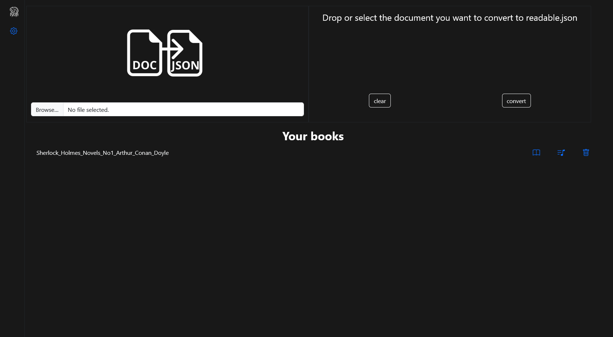
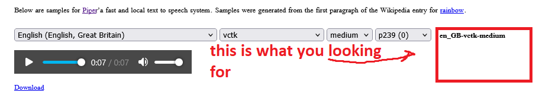

# What is BrainRootReader (BRR)?
It's a Read Aloud app that can read epub, docx, pdf and txt files.
It can also convert to a one file audiofile that you can take with you.

# Getting started:
## For tech-savy users:
1. Go to the [releases](https://github.com/floorwarior/brainrootreader-stable/releases) page.
2. Open Assets.
3. Download brainrootreadersetup-latestversion.exe
4. Install to your **Desktop**
5. Go to the [dependencies](#dependencies) section and check what else you might need to download

## For developers:
# Install without the cli
```

# clone the project: 
git clone https://github.com/floorwarior/brainrootreader-stable

# move into the folder
cd brainrootreader-stable

# make a virtual environment
python.exe -m venv .venv

# activate the virtual environment
.venv\Scripts\activate.bat

# install base requirements:
pip install -r requirements-[base].txt

# pick a backend you want to use
pip install -r requirements-[piper-tts].txt

# run the app
python.exe background.py


# open localhost:5003/settings select your reader example: PiperReader save
# start listening to books/docs
```
## istalling multiple tts backends at the same time can be done with the cli:

```
# clone the project: 
git clone https://github.com/floorwarior/brainrootreader-stable

# move into the folder
cd brainrootreader-stable

# make a virtual environment
python.exe -m venv .venv

# activate the virtual environment
.venv\Scripts\activate.bat

# install base requirements:
pip install -r requirements-[base].txt -r requirements-[cli].txt


# run the cli:
python.exe -m tools.cli --ignore_venv
 
# select the root of the project . is usually fine
# select the reader you want to install
# use install-in-current-venv if you use *threading* in the appconfig.json
# use install-in-dedicated-venv if you are using subprocess
```


# Dependencies:
## piper-tts depends on [espeak-ng](https://github.com/espeak-ng/espeak-ng):
- to run BRR you will have to install the latest release of espeak-ng
- without this the app/project will not run
- [espeak-ng releases](https://github.com/espeak-ng/espeak-ng/releases)
- look for assets, download and install espeak-ng.msi on windows

## f5-tts depends on [ffmpeg](https://ffmpeg.org/download.html):
- install it and make sure it's also added to your path
- f5-tts will not run without this


# Once BRR is running:
- visit http://localhost:5003


- upload the book you want to listen to and start listening or converting into an audio file


# Controls on Read book page:
| Button | Controls: |
| :----- | ----: | 
| s | start reading page  |
| space | pause/continue reading page, will not start the page if there was no s pressed previously |
| n | next page |
| p | previous page |
| b | bookmark page |
| j then b | jump to bookmarked page |
| j | open jump to dialog |
| + | increase volume |
| - | decrease volume |
| m | mute/unmute reading |


# What backend to install?
| Reader | System Requirements | Needs GPU | Generation Speed | Docs | Voice Quality | Language support|
|:---|----|----|----|----|----|----:|
| WinTTS/SAPI | your grandmas pc | no and can not use | Extreme | Far in between, but should not break | Painfull | Excellent |
| Piper | your grandpas pc | No | Very Fast | Good, easy to follow docs | Good, but gets old in longer listening sessions | Excellent, a massive number of languages are supported  *40+* |
| Kokoro | Almost Anything | Can use but not required | Fast | Good | Very Good | kind of low, would be a lot better with more languages *8* |
| Coqui/xtts-v2 | Needs a decent pc | Yes | Slow/Medium  | Bad/outdated | Very good, can contain unwanted words, however | Low *8*|
| Qwen-TTS | needs a decent pc | Yes | Slow | Alright | Great/ sometimes overly expressive | Low *10* |
| F5-TTS | needs a good pc | Yes | Slow | Poor Documentation, fragile  | Excellent, the best voice clone i have seen so far | Decent/ the community can train models for languages | 
| Supertonic | okay pc with a good cpu | does not need one | Fast | Good | Good | 
 


# What can i convert with BRR?
| Filetype              | Can it convert | Limitations |
| :---------------- | :------: | ----: |
| Epub ( should pretty much always work )        |   Yes [X]   | No image/diagram/table conversion |
| Pdf ( true pdf not image )        |   Yes [X]   | same as epub |
| Pdf ( made from images )           |   Yes [X]   | you first have to convert the pages into images then convert this to a zip file |
| Txt (simple .txt files ) | Yes [X] | Should be okay to use for videos as long as you check if the voice can be used in such fashion |
| Docx | Yes [X] | same as epub | 

# How to add different videos?
- you can add either use local videos ( mp4, webm ), or video links from youtube, you can add them [here](http://localhost/addvideo)


# How to add new voice models?
## Piper
- to sample the voices you can checkout this [link](https://rhasspy.github.io/piper-samples/) you can either download one from there and place the files inside the readers models folder in this case: [pipermodels](./pipermodels/)

- alternativly you can try the built in downloader [VoiceBag](http://localhost:5003/voicebag) if you combine these 2, you can sample the voice and then look for its name on the right:




- download from the [VoiceBag](http://localhost:5003/voicebag)

:


- if you are more confident in your skills you can look directly [here](https://huggingface.co/rhasspy/piper-voices/tree/main)

after you got your model you need to select it in the [settings](http://localhost:5003/settings), for your reader
## Kokoro
you can sample kokoros voices [here] (https://huggingface.co/spaces/hexgrad/Kokoro-TTS)
how to get the voice model depend on if you are using a built BRR (.exe) or the github repo directly

**for compiled version users:**
- you will need to download the voice model from here: (in the next update it will be added to the voicebag for dirrect download)
https://huggingface.co/hexgrad/Kokoro-82M/tree/main/voices
- then place it inside the kokoromodels folder
- set the name of the model in [kokoros readerconfig](readerconfigs/kokororeader.json) note: this is a filename, example af_heart.pt
**for developers:**
- set the name of the voice in the [config](readerconfigs/kokororeader.json) note this is the name of the model: af_heart


# How to change fallback order of readers ?
in the [globalvoicemodelsettings](./readerconfigs/globalreader.json)
```
{
    "name": "KokoroReader",
    "type": "builtin",
    "comment": "To use this you can pick either *builtin* or if you want to use a selfmade reader you need to use *custom*",
    "comment2": "The name also have to match the name of the class you want to import",
    "comment3": "Add the ClassName and its config filename to readerconfigs.json",
    "fallbackorder": [
        "PiperReader",
        "WinReader",
    ],
    "comment4": "We set the correct order for the readers, the default selected reader is KokoroReader and in the worst case we will use window's built in SAPI reader"
}
```


# How to make generation faster?
to improve audio generation time, you can try to use subprocess:
for this open the [appconfig file](appconfig.json)
and change threading to subprocess
set the core count to: 2 =< x <= your system's core count 
**Note: depending on your system this will take horsepower, if you want to multitask keep it as low as 2**


# How to add my own reader?
your reader should subclass [BaseReader_in_bookreaders.py](./helpers/bookreaders.py)
Most importantly you will have to implement *Speak* and *save_audio*
If your reader imported okay and it's ready to use you need to set both imported_ok and ready to true
check out [piper_reader](./helpers/bookreaders.py) to get a better idea


you need to put your reader's implementation in [plusreaders_folder](./plusreaders)
then you also have to add it by name to [the_plusreaders_by_name_config](./plusreaders/plusreadersbyname.json):
```
{
    "examplereader":"MyReader",
    "testreader":"ThisIsTest"
}
# follow the pymodul:Classname convention
```
after this you need to define a config file that your reader needs in [readerconfigs](./readerconfigs/readerconfigs.json), put the config into [readerconfigs](./readerconfigs/)
```
{
    "PiperReader":"piperconfig.json",
    "WinReader":"winconfig.json",
    "MyReader":"myreader.json",
    "ThisIsTest":"thisistest.json",a
    "GoogleReader":"googlereader.json",
    "AndroidReader":"androidreader.json",
    "BrowserReader":"browserreader.json",
    "SherpaReader":"sherpareader.json"
}
```
if your reader does not need a config file you still need to add one here, but you can leave it with: {}
with all of these step your reader will be picked up by BRR, and should show up in http://localhost:5003/settings